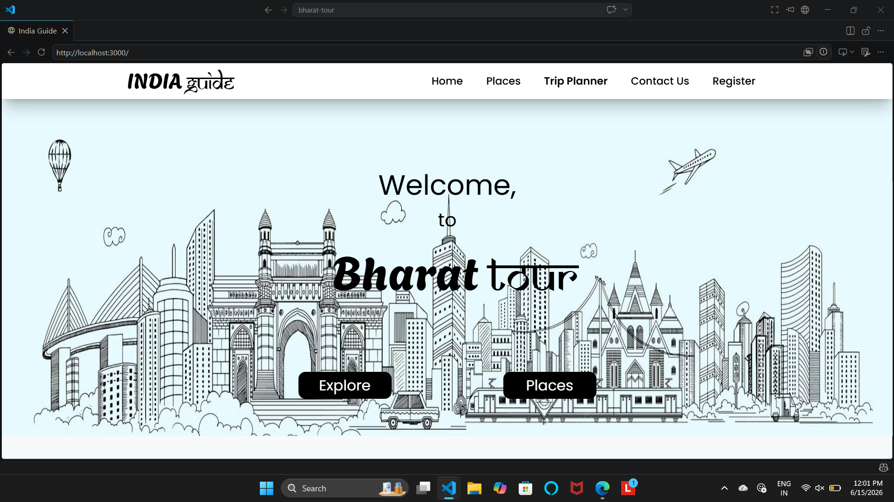
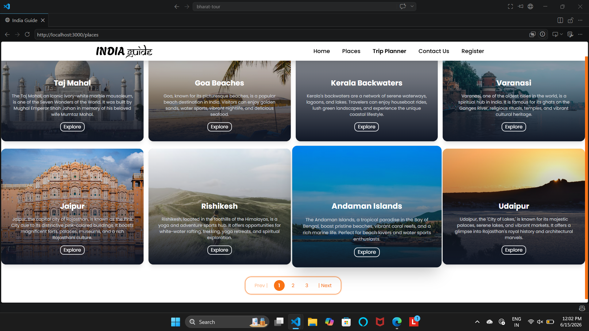
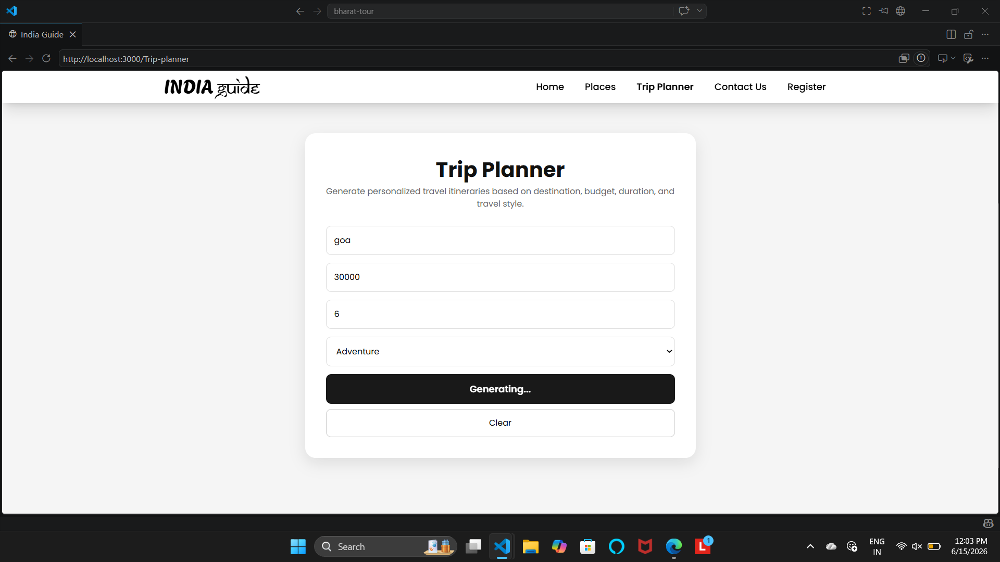
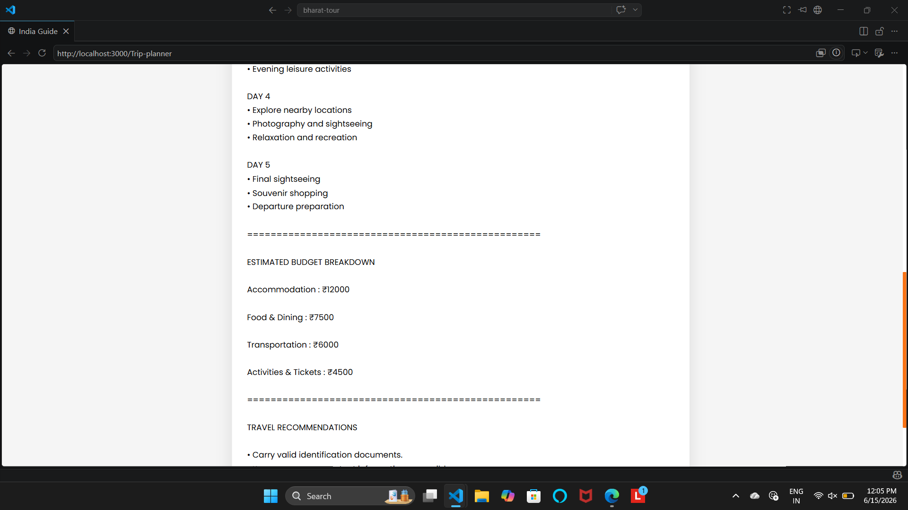

# Bharat Tour – India Travel Guide & Trip Planner

Bharat Tour is a full-stack travel planning web application that helps users explore popular destinations across India and generate personalized travel itineraries based on destination, budget, trip duration, and travel preferences.

## Features

* Explore popular tourist destinations across India
* Filter destinations by state and category
* Generate personalized travel plans
* Responsive and user-friendly interface
* React frontend with Express backend
* Destination discovery and travel recommendations

## Tech Stack

### Frontend

* React.js
* React Router
* JavaScript
* CSS

### Backend

* Node.js
* Express.js

## screenshots

### Home Page



### Places Explorer



### Trip Planner



### Generated Travel Plan



## Installation

### Clone Repository

```bash
git clone https://github.com/SaiAlekhya12/bharat-tour.git
```

### Frontend Setup

```bash
npm install
npm start
```

### Backend Setup

```bash
cd backend
npm install
node server.js
```

## Future Enhancements

* AI-powered itinerary generation
* Hotel and restaurant recommendations
* Weather integration
* Interactive maps
* User authentication and saved trips

## Author

**Yadlapalli Sai Alekhya**

B.Tech – Artificial Intelligence and Data Science

Shri Vishnu Engineering College for Women
